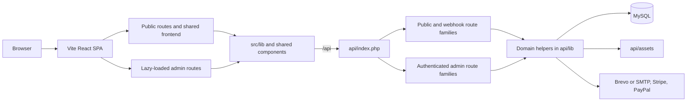

# DESIGN.md

## Repository Architecture

## Cross-Cutting Architecture Decisions

- **Decision:** The repository stays unified. The public website, admin console, and backend API share one codebase because branding, booking, document, and patient workflows cross these boundaries continuously.
- **Decision:** The frontend remains a single SPA even though it contains both public and admin surfaces. The split is enforced with routing and lazy loading rather than separate frontend projects.
- **Decision:** The admin UI stays route-based with local ownership per tab rather than returning to a single stateful admin page.
- **Decision:** Booking is the operational entry point into the practice system: a public booking may reserve a slot, create or link a patient record, trigger therapist notifications, and begin payment/document history.
- **Decision:** Group capacity distinguishes between official participants and unnamed reservations. Both consume seats for operational planning and homepage promotion, but only official participants participate in payment, invoicing, workbook, and patient-history flows.
- **Decision:** The document system is DB-backed for templates and branding, but generated files remain archived under `api/assets/` so sent documents and uploads stay restorable.
- **Decision:** Build-time and operator-run automation lives in `scripts/` so prerendering and backup logic can evolve with the app instead of being split across ad-hoc hosting-panel steps.
- **Decision:** Backup retention is intentionally split by archive class: financial records go to the `10`-year retention path, while general operational archives use the `2`-year path.
- **Decision:** Backup storage for `api/assets/` is content-addressed and manifest-driven so unchanged files do not create duplicate blobs on every backup run.
- **Decision:** `docs/plans/` is the place to incubate work-specific design docs before durable outcomes are promoted into permanent specs.

## Durable Boundaries

- [src/DESIGN.md](src/DESIGN.md): frontend routing, SEO, analytics, and public booking flow
- [src/admin/DESIGN.md](src/admin/DESIGN.md): admin route layout, tab ownership, and UI architecture
- [api/DESIGN.md](api/DESIGN.md): request routing, domain services, booking/payment/document flows
- [scripts/DESIGN.md](scripts/DESIGN.md): prerender and backup automation flows

## Documentation Layering and Authority

- Root docs describe repo-wide product shape and cross-cutting architecture.
- Subtree docs refine the nearest stable boundary instead of repeating the root.
- When a subtree needs to depart from a root rule, update the root docs first so the change is explicit.
- `docs/plans/` may explain a change in progress or record a completed implementation effort, but permanent docs and code own the lasting truth.
