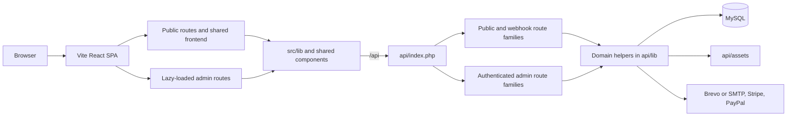

# DESIGN.md

## Repository Architecture

## History-Derived Stable Decisions

- The repository began as a public Vite SPA and evolved into an integrated practice operations system without splitting into multiple repos.
- The frontend remained a single SPA even as scheduling, payments, documents, and patient records moved server-side.
- The admin UI was intentionally refactored from one large page into route-based tabs with local hook ownership.
- Booking became the entry point into the operational model: a public booking can reserve a slot, create a patient record, trigger notifications, and start invoice/document flows.
- The document system evolved from fixed templates into DB-backed template editing, sending-point mappings, branding controls, and generated archives.
- Long-term backups are intentionally split by retention class: financial records go to a `10`-year bucket, while general operational archives go to a `2`-year bucket.
- Backup storage for `api/assets/` is content-addressed with timestamped manifests so restores can be reconstructed without re-uploading unchanged files on every backup run.
- `docs/plans/` became the place to incubate larger changes before promoting durable outcomes into permanent specs like this file.

## Durable Boundaries

- [src/DESIGN.md](src/DESIGN.md): frontend routing, SEO, analytics, and public booking flow
- [src/admin/DESIGN.md](src/admin/DESIGN.md): admin route layout, tab ownership, and UI architecture
- [api/DESIGN.md](api/DESIGN.md): request routing, domain services, booking/payment/document flows

## Documentation Layering

- Root docs describe repo-wide product shape and cross-cutting architecture.
- Subtree docs refine the nearest stable boundary instead of repeating the root.
- `docs/plans/` may explain a change in progress or record a completed implementation effort, but permanent docs and code own the lasting truth.
