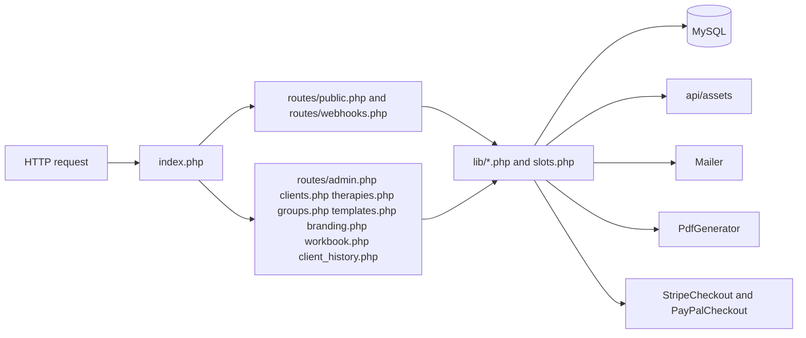
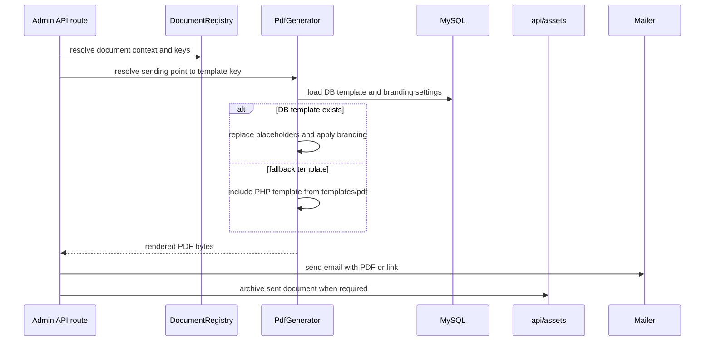

# DESIGN.md

## Backend Architecture



## Public Booking Flow

```mermaid
sequenceDiagram
  actor Visitor
  participant Public as routes/public.php
  participant Slots as slots.php
  participant DB as MySQL
  participant BookingDocs as BookingNumber and BookingPaymentRequest
  participant Invoice as InvoiceNumber and BookingInvoice
  participant Notify as BookingNotification and Mailer
  participant Payments as StripeCheckout or PayPalCheckout

  Visitor->>Public: POST /api/bookings
  Public->>Slots: generateSlots(date, date)
  Slots->>DB: load rules, events, and reserved bookings
  Slots-->>Public: availability decision
  Public->>DB: insert booking with pending_payment
  Public->>BookingDocs: generate booking number
  Public->>DB: auto-create linked patient when possible
  Public->>DB: record intro-call request event for patient timeline

  alt stripe or paypal branch
    Public->>Payments: create checkout session or order
    Payments-->>Public: redirect URL
  else wire transfer branch
    Public->>BookingDocs: generate payment request PDF and archive it
  end

  Public->>Notify: send therapist notification
  Public-->>Visitor: payment-aware response

  Note over Invoice,DB: Invoice generation is deferred until payment confirmation exists; starting or completing the appointment alone is not enough.
```

## Document and Branding Flow



## Stable Design Decisions

- **Decision:** The backend stays framework-free and function-oriented: route files contain request handling, while reusable operational logic lives in `lib/`.
- **Decision:** `index.php` may short-circuit to a gitignored `local_dev_reset_wizard.php` for destructive local-only resets, but only when the file exists and localhost/site-url guards pass.
- **Decision:** `slots.php` is the canonical availability engine for public booking; it derives availability from recurring rules, exceptions, events, and bookings with reserved states.
- **Decision:** For intro calls, `slots.php` must continue treating `completed` bookings as reserved so finished appointments do not reopen their slot accidentally; only explicit cancellation releases the slot.
- **Decision:** Group seat reservations live separately from `group_participants` so unnamed seats can consume capacity without leaking into payment, invoicing, workbook, or patient-history logic.
- **Decision:** Bookings are inserted as `pending_payment` first, which lets the system reserve the slot before payment confirmation or manual completion.
- **Decision:** Intro-call documents now have two phases: a payment request with its own booking number at booking time, and the actual invoice only after a payment-confirmed transition.
- **Decision:** Intro-call lifecycle history is intentionally event-backed for patient timelines, while sent PDFs remain archived in `client_documents`; together they capture both operational state changes and outward-facing documents.
- **Decision:** Backup tooling relies on `client_documents` metadata plus file paths under `api/assets/` to separate financial archive files from general archived files, so invoice/payment-request retention can be enforced outside the app server without duplicating classification rules by hand.
- **Decision:** `Mailer` selects Brevo when configured, otherwise SMTP, and retries once on transient delivery failures.
- **Decision:** `PdfGenerator` prefers DB-backed HTML templates and falls back to file templates, while still applying brand styling and placeholder replacement consistently.
- **Decision:** Patient history is still assembled from operational tables, but intro-call lifecycle changes use a dedicated event table so request/reminder/cancellation/payment transitions do not have to be inferred from mutable booking rows.
