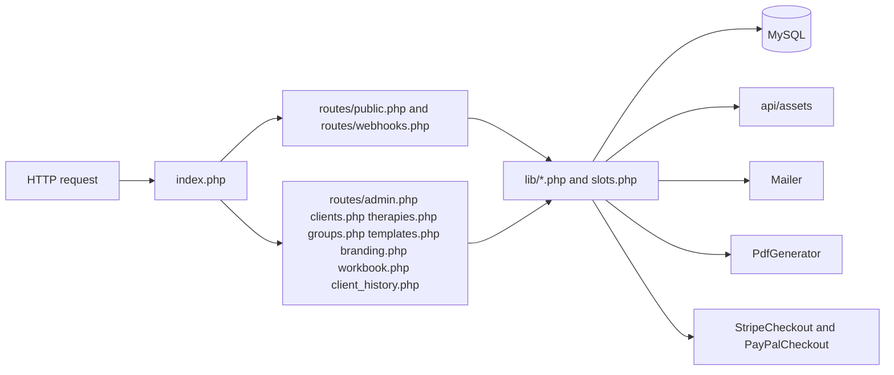
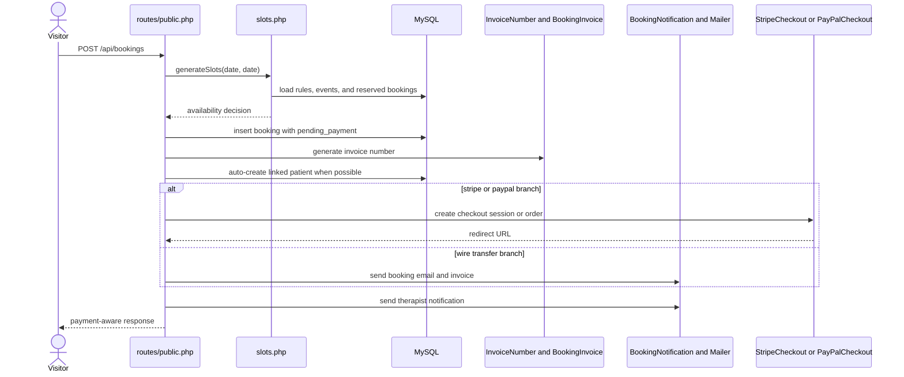
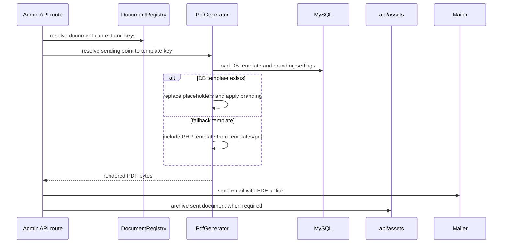

# DESIGN.md

## Backend Architecture

## Public Booking Flow

## Document and Branding Flow

## Stable Design Decisions

- The backend stays framework-free and function-oriented: route files contain request handling, while reusable operational logic lives in `lib/`.
- `slots.php` is the canonical availability engine for public booking; it derives availability from recurring rules, exceptions, events, and bookings with reserved states.
- Bookings are inserted as `pending_payment` first, which lets the system reserve the slot before payment confirmation or manual completion.
- `Mailer` selects Brevo when configured, otherwise SMTP, and retries once on transient delivery failures.
- `PdfGenerator` prefers DB-backed HTML templates and falls back to file templates, while still applying brand styling and placeholder replacement consistently.
- Patient history is assembled from multiple operational tables rather than stored as a separate event log, which keeps the timeline derived from source records.
