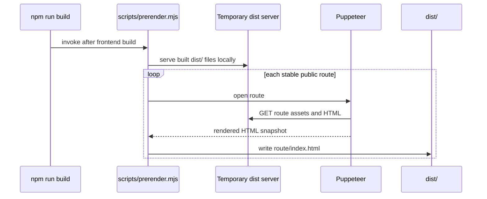
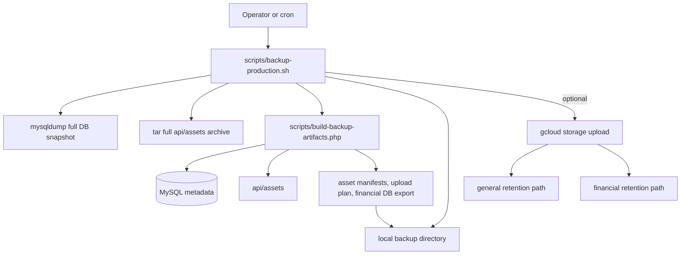

# DESIGN.md

## Prerender Flow

## Backup Flow

## Stable Design Decisions

- **Decision:** `prerender.mjs` runs after the SPA build and writes route-specific HTML snapshots into `dist/` rather than replacing React routing with a separate static-site generator.
- **Decision:** Prerendering uses a temporary local server plus Puppeteer so the exported HTML reflects the built client bundle and runtime metadata behavior that users actually receive.
- **Decision:** `backup-production.sh` remains the shell orchestrator for local snapshots, optional uploads, and scheduling decisions, while `build-backup-artifacts.php` handles database-aware classification because that logic depends on application data structures.
- **Decision:** The backup strategy intentionally combines a simple local full backup (`db.sql.gz` plus `api-assets.tar.gz`) with remote incremental uploads so restores stay straightforward without paying repeated long-term storage costs for unchanged files.
- **Decision:** Asset classification between `financial` and `general` is derived from durable database metadata, especially archived payment requests and invoices, rather than a hand-maintained file allowlist.
- **Decision:** Remote upload is optional and schedule-based; the scripts must still produce complete local backup output even when no GCS environment is configured.
