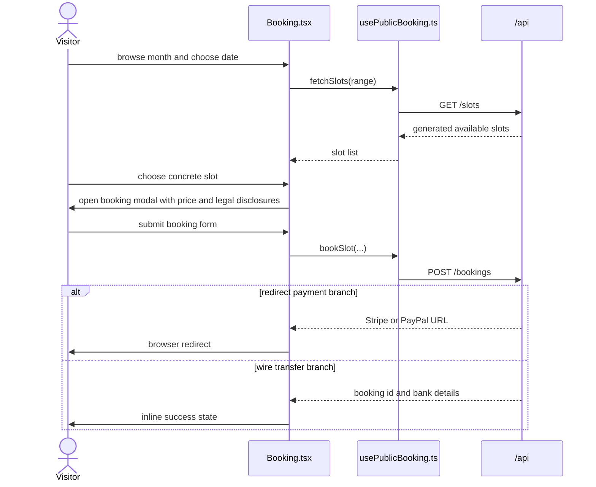

# DESIGN.md

## Frontend Structure

```mermaid
flowchart TD
  Main[main.tsx] --> AnalyticsInit[initAnalytics()]
  Main --> App[App.tsx]
  App --> PublicRoutes[Public route components]
  App --> AdminRoutes[Lazy admin route branch]
  PublicRoutes --> PublicPages[Home, Service, Article, legal, booking result pages]
  PublicPages --> SharedComponents[Header, Footer, Booking, Contact, JsonLd]
  SharedComponents --> SharedLib[src/lib]
  SharedLib --> ApiClient[apiFetch]
  SharedLib --> LocalContent[data.ts]
  SharedLib --> SeoLayer[useDocumentMeta and JsonLd]
  SharedLib --> ConsentAnalytics[consent.ts and analytics.ts]
```

## Public Booking Flow



## Stable Design Decisions

- **Decision:** `App.tsx` is the single route root for both public and admin branches; admin code is lazy-loaded so the public site does not eagerly load the full admin UI.
- **Decision:** `useDocumentMeta()` owns runtime title, canonical, Open Graph, and Twitter metadata, while `scripts/prerender.mjs` materializes the stable public routes after build.
- **Decision:** Consent gating happens before analytics initialization. On `localhost` and under `/admin`, analytics stays disabled even if consent exists.
- **Decision:** Public booking is slot-first: selecting a concrete slot opens the booking modal that restates slot context, price, and legal disclosures before the submission request is sent.
- **Decision:** Shared browser state is intentionally small: consent in `localStorage`, auth token in `sessionStorage`, and no client-side duplication of operational booking truth.
- **Decision:** Public content remains code-authored, which keeps the deployment simple but means content changes ship through the normal code pipeline.
