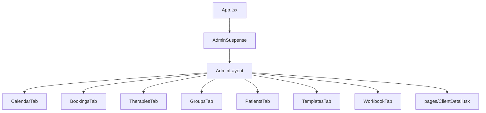
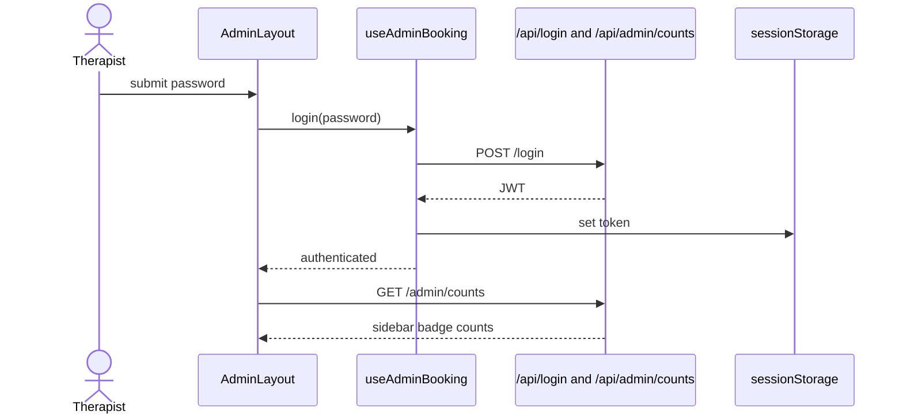

# DESIGN.md

## Route Architecture

## Route and Hook Ownership

| UI surface | Primary hooks | Durable responsibility |
|---|---|---|
| `AdminLayout` | `useAdminBooking` | Auth gate, login/logout, nav counts, shared shell |
| `CalendarTab` | `useAdminBooking` | Rules, events, blocked days, calendar session preview, cancellations |
| `BookingsTab` | `useAdminBooking`, `useAdminClients` | Intro-call bookings, booking/payment-request visibility, payment reminders, separate payment-vs-appointment actions, deferred invoice generation, and migration to patient |
| `TherapiesTab` | `useAdminTherapies`, `useAdminClients` | Individual therapies and session lifecycle |
| `GroupsTab` | `useAdminGroups`, `useAdminClients` | Group setup, participants, seat reservations, sessions, attendance, invoices |
| `PatientsTab` | `useAdminClients` | Patient list and navigation into detail history |
| `ClientDetail` | `useClientHistory` | Timeline aggregation, status/document filtering, notes, sent/received documents |
| `TemplatesTab` | `useAdminTemplates`, `useAdminBranding` | Template CRUD, preview, mappings, branding, logo variants |
| `WorkbookTab` | `useAdminWorkbook`, `useAdminTherapies`, `useAdminGroups`, `useAdminClients` | Material library and distribution targeting |

## Login and Shell Flow

## Stable Design Decisions

- **Decision:** The admin shell is route-based rather than tab-state-based; navigation is URL-addressable and each tab mounts independently.
- **Decision:** Auth ownership stays in `AdminLayout`, while feature ownership stays inside the tab or detail page that needs the data.
- **Decision:** `BookingsTab` is the control point for the transition from booking request/payment request to payment confirmation and finally invoice creation, so it must mirror server truth after every action rather than infer invoice readiness from a single status field.
- **Decision:** The booking cards intentionally expose separate therapist actions for payment confirmation, appointment start/completion, reminder mail, and cancellation, because those actions have different downstream archive and billing consequences.
- **Decision:** `ClientDetail` keeps timeline filtering in the page layer so patient history can be sliced into status-vs-document views without changing the backend timeline contract.
- **Decision:** Group seat management separates official participants from unnamed reservations in the UI. Both affect capacity, but only participants create future payment rows and other patient-bound workflows.
- **Decision:** Binary workflows such as template preview, workbook preview, and document downloads use raw `fetch()` or query-token URLs when `apiFetch()` is not sufficient for `FormData` or binary responses.
- **Decision:** Ant Design is the design system for the admin area, with `src/admin/theme.ts`, `src/admin/styles.ts`, and shared constants carrying the common visual language.
